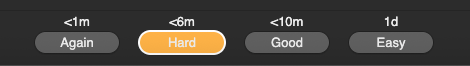
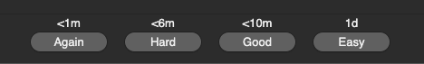

# Anki Last Ease Highlight Add-on
Anki add-on that highlights the answer button you pressed **last time** for each card during review.

## What is Anki to those who did not know
Anki is a flashcard app that uses spaced repetition to help you memorize information efficiently.

## How it works
- **First time** seeing a card → no highlight
- **Subsequent reviews** → the button you pressed previously (Again/Hard/Good/Easy) glows light orange (`#FFB347`)

## Example
If you pressed **Again (1)** on a card yesterday, today the Again button will be light orange when reviewing that card.

## Why?
- See at a glance how you rated a card last time
- Identify cards you keep pressing "Again" on
- Spot patterns in your review behavior

## Installation

### Manual
1. Download `__init__.py` from this repo
2. Open your Anki add-ons folder:
   - **Windows:** `%APPDATA%\Anki2\addons21\`
   - **Mac:** `~/Library/Application Support/Anki2/addons21/`
   - **Linux:** `~/.local/share/Anki2/addons21/`
3. Create a new folder named `anki-last-ease-highlight-addon`
4. Copy `__init__.py` into that folder
5. Restart Anki

## Screenshots

